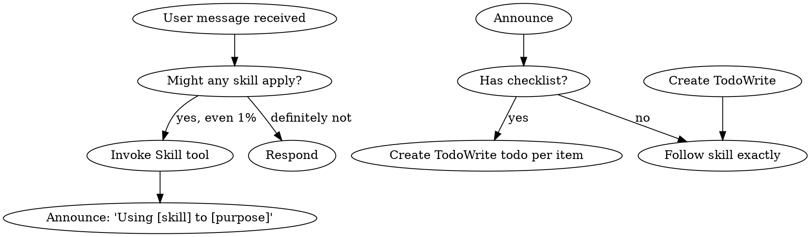
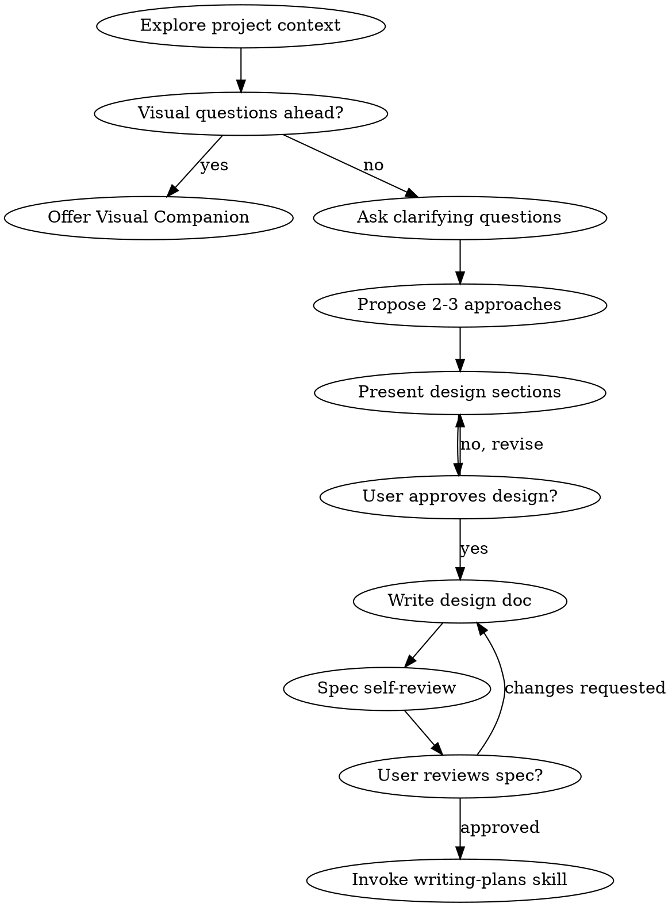
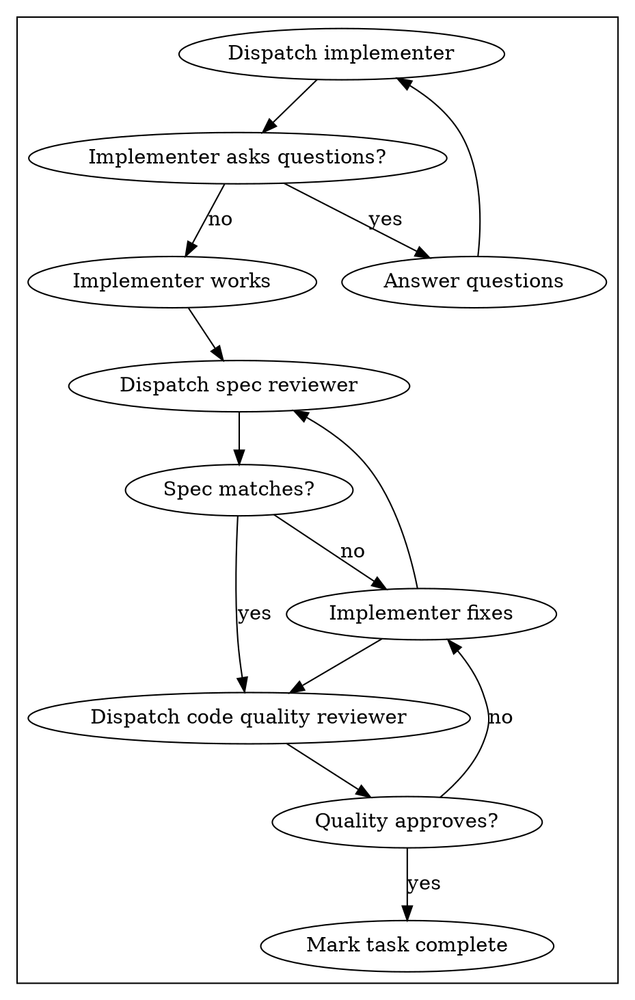
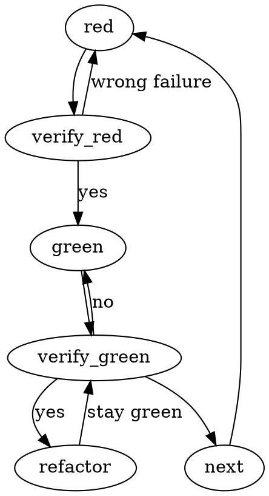
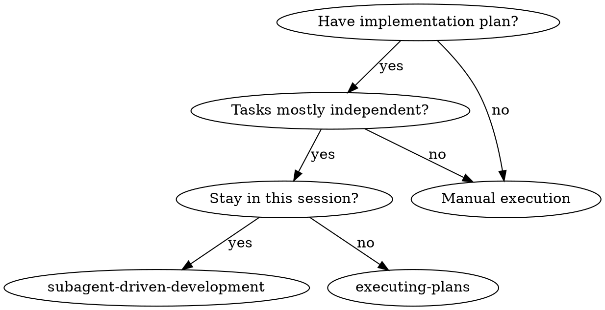

# 05 流程图/状态机

流程图是结构性权重中**最严格的顺序控制**——用图形化方式规定步骤、分支和回环，AI 没有裁量空间。

## Superpowers 中的流程图

### 5.1 技能调度流程图

**来源**：`skills/using-superpowers/SKILL.md:48-75`



**控制特征**：
- 菱形节点 = 分支决策——每个分支有明确标签（"yes, even 1%"）
- 矩形节点 = 动作——AI 必须执行
- 双圆节点 = 起止——明确的入口和出口
- 没有"跳过"边——AI 无法绕过任何步骤

### 5.2 头脑风暴流程图

**来源**：`skills/brainstorming/SKILL.md:37-63`



**控制特征**：
- 回环路径（"no, revise"、"changes requested"）——不允许跳过，必须回退修正
- 唯一出口（"Invoke writing-plans skill"）——终态锁定
- 线性主路径 + 条件分支——正常流程和异常处理都覆盖

### 5.3 子智能体驱动开发流程图

**来源**：`skills/subagent-driven-development/SKILL.md:42-76`



**控制特征**：
- 审阅不通过 → 回环到审阅者（不是跳过）
- 顺序锁死：实现 → 规范审阅 → 代码审阅
- 每个任务独立循环——任务内不通过不外溢

### 5.4 TDD Red-Green-Refactor 循环图

**来源**：`skills/test-driven-development/SKILL.md:49-68`



**控制特征**：
- 验证节点（verify_red、verify_green）——每个阶段后必须验证
- 回环路径（"wrong failure" → 回到 red）——验证失败不能前进
- "stay green"——重构时保持测试通过

### 5.5 执行路径选择图

**来源**：`skills/subagent-driven-development/SKILL.md:16-31`



**控制特征**：
- 决策树式分支——每个问题有明确的 yes/no
- 叶子节点是技能名——最终指向具体行动
- 没有模糊的"视情况而定"

## 流程图 vs 文字描述的权重差异

```
  文字描述：
  ────────
  "先实现，然后审阅规范，最后审阅代码质量"
  → AI 可能跳步、可能调换顺序
  → 线性文本不显示分支和回环

  流程图：
  ────────
  [实现] → [规范审阅] → [代码审阅]
               ↑ 不通过    ↑ 不通过
               └── 修复 ──┘ 修复
  → 分支可见、回环可见
  → AI 看到"不通过必须回环"就不能跳过
  → 图形结构比文字更难被"重新解读"
```

## 流程图的格式选择

Superpowers 使用 Graphviz dot 语言而非纯文字描述。原因：

```
  ┌──────────────────────────────────────────────────────────┐
  │  Graphviz dot 的优势：                                   │
  │                                                          │
  │  1. 结构性                                               │
  │     节点和边是显式定义的，不像自然语言有歧义             │
  │                                                          │
  │  2. 可验证                                               │
  │     可以从图中推导出"是否存在从 A 到 B 的路径"           │
  │     文字描述无法做这种验证                               │
  │                                                          │
  │  3. 分支标签                                             │
  │     每条边可以有 label，明确条件                         │
  │     "yes, even 1%" 比 "如果有哪怕一点可能" 更精确        │
  │                                                          │
  │  4. 回环可见                                             │
  │     图中可以清楚看到回路——"不通过回到修复"               │
  │     文字描述中回环容易被忽略                             │
  │                                                          │
  │  5. AI 可以渲染                                          │
  │     LLM 能理解 dot 语法并生成可视化图                    │
  │     代码即文档，文档即规范                               │
  └──────────────────────────────────────────────────────────┘
```
